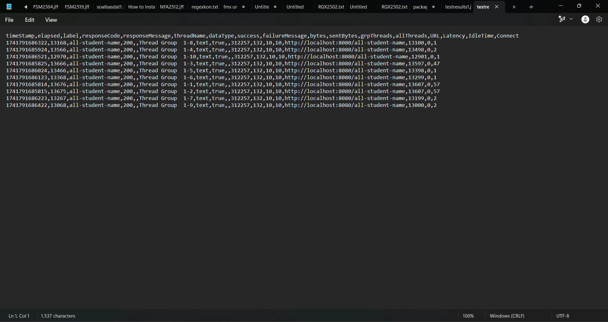

Screenshot sebelum profiling dengan JMeter GUI:

all-student-name:

highest-gpa:

Screenshot sebelum profiling log hasil JMeter CLI:

all-student-name:

highest-gpa:

Screenshot sesudah profiling dengan JMeter GUI:

all-student-name:

highest-gpa:

Screenshot setelah profiling log hasil JMeter CLI:

all-student-name:

highest-gpa:

Kesimpulan :
Profiling membantu mengidentifikasi bagian kode yang tidak efisien, sehingga memungkinkan optimisasi yang dapat menurunkan waktu eksekusi secara signifikan. Dari hasil sebelum dan sesudah profiling, terlihat bahwa perbedaan waktu eksekusi cukup besar, menunjukkan dampak nyata dari peningkatan performa kode. Dengan melakukan profiling, kita dapat menemukan bottleneck dalam eksekusi program dan menerapkan optimasi yang tepat, sehingga kode berjalan lebih cepat dan efisien. Hal ini membuktikan bahwa profiling bukan hanya alat analisis, tetapi juga strategi penting dalam pengembangan perangkat lunak untuk meningkatkan efisiensi dan performa aplikasi.

Reflection

>Please answer the following questions:
>1. What is the difference between the approach of performance testing with JMeter and profiling with IntelliJ Profiler in the context of optimizing application performance?
>2. How does the profiling process help you in identifying and understanding the weak points in your application?
>3. Do you think IntelliJ Profiler is effective in assisting you to analyze and identify bottlenecks in your application code?
>4. What are the main challenges you face when conducting performance testing and profiling, and how do you overcome these challenges?
>5. What are the main benefits you gain from using IntelliJ Profiler for profiling your application code?
>6. How do you handle situations where the results from profiling with IntelliJ Profiler are not entirely consistent with findings from performance testing using JMeter?
>7. What strategies do you implement in optimizing application code after analyzing results from performance testing and profiling? How do you ensure the changes you make do not affect the application's functionality?

**Jawab**

1. Perbedaan utama antara pengujian performa dengan JMeter dan profiling dengan IntelliJ Profiler terletak pada fokus dan pendekatannya. JMeter digunakan untuk menguji performa aplikasi dari perspektif eksternal, dengan mensimulasikan beban pengguna dan mengukur waktu respons serta throughput. Sementara itu, IntelliJ Profiler berfungsi untuk menganalisis performa aplikasi dari dalam dengan memberikan wawasan tentang konsumsi CPU, memori, dan identifikasi bottleneck pada kode. Dengan kata lain, JMeter lebih berorientasi pada pengujian beban, sedangkan IntelliJ Profiler lebih mendetail dalam menganalisis efisiensi eksekusi kode.

2. Proses profiling sangat membantu dalam mengidentifikasi titik lemah dalam aplikasi karena memberikan data konkret mengenai penggunaan sumber daya dan eksekusi fungsi dalam kode. Dengan melihat metrik seperti waktu eksekusi metode, alokasi memori, serta penggunaan CPU, kita dapat memahami bagian mana dari kode yang memerlukan optimasi. Profiling juga memungkinkan kita untuk melihat apakah ada proses yang berjalan lebih lama dari yang seharusnya atau jika ada alokasi memori yang tidak efisien.

3. Ya, IntelliJ Profiler sangat efektif dalam membantu menganalisis dan mengidentifikasi bottleneck dalam kode aplikasi. Dengan fitur visualisasi data seperti flame graph dan call tree, kita dapat dengan mudah melihat bagian kode yang paling membebani performa aplikasi. Selain itu, kemampuannya untuk melakukan real-time profiling memungkinkan kita untuk mengamati perubahan performa setelah optimasi dilakukan, sehingga dapat langsung mengukur dampaknya.

4. Tantangan utama dalam melakukan pengujian performa dan profiling adalah menginterpretasikan hasil dengan benar dan menemukan solusi optimasi yang tepat. Dalam pengujian dengan JMeter, salah satu tantangan adalah memastikan lingkungan pengujian menyerupai kondisi produksi agar hasilnya relevan. Dalam profiling, tantangan utama adalah menangani noise dalam data yang dapat menyebabkan kesimpulan yang kurang akurat. Untuk mengatasinya, saya melakukan pengujian berulang kali dengan skenario berbeda untuk memastikan bahwa hasil yang diperoleh konsisten sebelum mengambil keputusan optimasi.

5. Manfaat utama dari menggunakan IntelliJ Profiler adalah kemampuannya dalam memberikan wawasan mendalam tentang bagaimana aplikasi berjalan di tingkat internal. Dengan profiling, saya dapat menemukan metode yang paling banyak menggunakan sumber daya, mengurangi konsumsi memori yang tidak perlu, serta meningkatkan efisiensi algoritma. Selain itu, profiler membantu dalam mendeteksi kebocoran memori dan optimasi penggunaan thread, yang sangat penting untuk meningkatkan performa aplikasi dalam skala besar.

6. Jika hasil profiling dengan IntelliJ Profiler tidak sepenuhnya konsisten dengan temuan dari pengujian performa menggunakan JMeter, saya akan melakukan analisis lebih lanjut terhadap metode pengukuran yang digunakan. Bisa jadi ada faktor eksternal seperti kondisi server, beban jaringan, atau konfigurasi JVM yang memengaruhi hasil pengujian. Untuk mengatasinya, saya akan menjalankan pengujian di lingkungan yang lebih terkontrol serta membandingkan hasil dari berbagai alat profiling untuk mendapatkan gambaran yang lebih akurat tentang performa aplikasi.

7. Setelah menganalisis hasil dari pengujian performa dan profiling, strategi utama dalam optimasi kode adalah mengurangi kompleksitas algoritma, memperbaiki alokasi memori, serta menghilangkan operasi yang tidak perlu. Saya juga memastikan bahwa perubahan yang dilakukan tidak mengubah fungsionalitas aplikasi dengan menjalankan pengujian unit dan integrasi secara menyeluruh setelah optimasi diterapkan. Dengan pendekatan ini, saya dapat meningkatkan performa aplikasi tanpa mengorbankan stabilitas dan keandalan sistem.